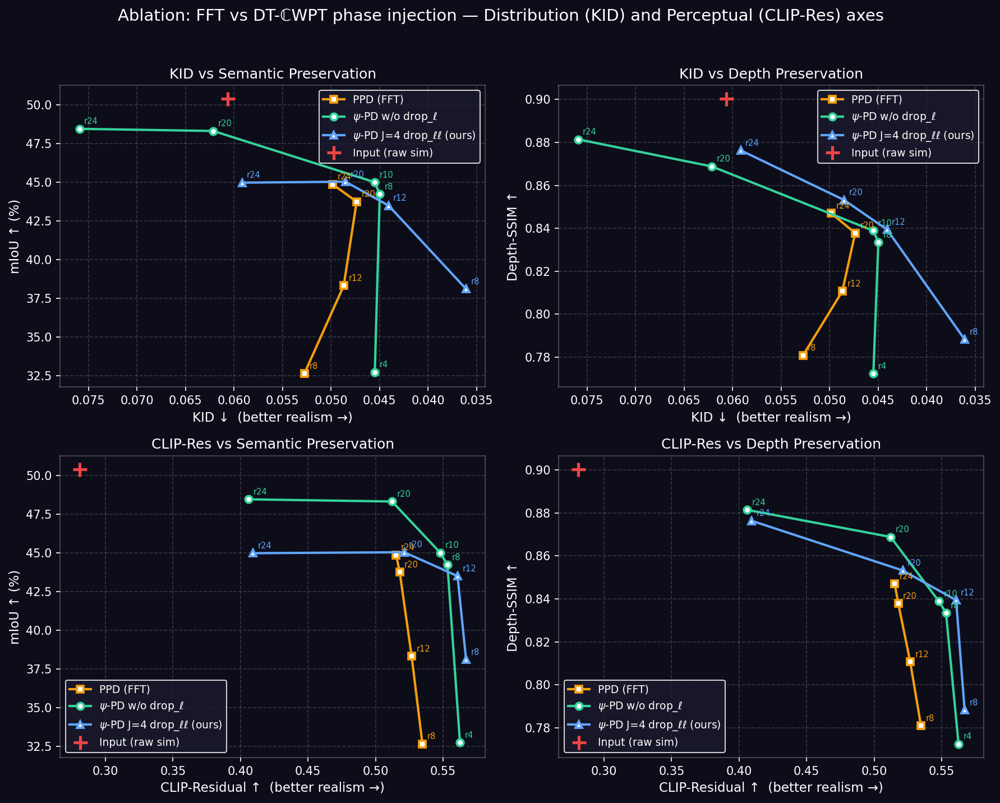
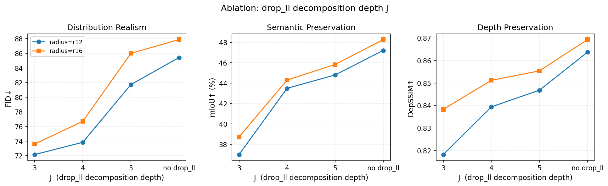

# vKITTI → KITTI (clone-only, 2126 frames)

FID/KID ref: KITTI tracking sequences 0001/0002/0006/0018/0020 (2126 frames, scene-matched). **CleanFID mode** (`--mode clean`).
mIoU: SegFormer-B5 (Cityscapes). Depth: Depth Anything V2 Large. LPIPS: AlexNet vs paired KITTI.
CLIP-IQA: piq.CLIPIQA. KITTI real CLIP-IQA = 0.3433 (reference). * = best (excl. raw sim).
† FLUX.1-Kontext: mIoU inflated by Cityscapes-style appearance (excluded from paper). Ablation infer drop_ll: flux.safetensors + --flux_drop_ll J=4 at inference only (no drop_ll training).
⚠️ WPD (PPD ckpt) r*: these used batch_sim2real_image_wavelet.py (DTCWT) — wrong inference script for PPD lora. Replaced by correct PPD (FFT) rows below.
Full table: `python summarize_vkitti_eval.py`

## Paper table (one variant per method)

WPD baseline variants reserved for ablation. No LPIPS.
CLIP-Residual (final = residual_v19): 5 antonym pairs —
  1. "A photo of real cars on a road." / "Computer graphics of cars on a road."
  2. "Realistic materials." / "Plastic-looking materials."
  3. "A sharp real photo." / "A blurry computer render."
  4. "A photograph of a real place." / "A CGI scene."
  5. "A photo with natural colors." / "An image with artificial colors."
`calc_clipiqa_prompts_vkitti.py --prompt_set residual_v19`, per-variant logs `logs/vkitti_eval/<v>_clipres.log`. nuCarla: ditto=0.496>dropll_r22_J4=0.495>…>input=0.367. Real KITTI scores 0.375 (reference only, not an anchor). Replaces default CLIP-IQA ("Good photo"/"Bad photo"), which has ~zero correlation with visual realism ranking (it scored raw sim 0.7180, above FlowEdit/Cosmos).
Frontier plot: `python plot_vkitti_frontier.py --output outputs/vkitti_frontier.pdf`

| Method | KID↓ | FID↓ | CLIP-Residual↑ | mIoU↑ | DepSSIM↑ | AbsRel↓ |
| :--- | :---: | :---: | :---: | :---: | :---: | :---: |
| Input (raw sim) | 0.0606 | 97.29 | 0.2808 | 50.39 | 0.9002 | 0.1573 |
| FlowEdit | 0.0485 | 82.41 | 0.4007 | *42.72* | 0.8119 | 0.2599 |
| DNAEdit | 0.0478 | 85.47 | 0.3222 | 41.22 | 0.8274 | 0.2539 |
| Cosmos depth+edge | *0.0452* | **73.52** | 0.4689 | 39.36 | **0.8700** | **0.2016** |
| PPD r12 | 0.0487 | 78.95 | *0.5267* | 38.32 | 0.8107 | 0.3439 |
| WPD J=4 r12 (ours) | **0.0441** | *73.84* | **0.5607** | **43.50** | *0.8394* | *0.2286* |

## Ablation 1: WPD baseline vs PPD (effect of new LoRA training)

Generate: `python plot_ablation1_4panel.py --output figures/ablation1_4panel.png --label-radii` (top row: KID axis; bottom row: CLIP-Residual v15 axis). Legacy 2-panel KID-only version: `python plot_ablation_baseline_vs_ppd.py`.

### Per-class mIoU: matched-mIoU pairs

Three pairs of methods at matched overall mIoU, isolating what drives KID differences. NR = NeuralRemaster (PPD, FFT-based); ψ-PD w/o CR = ψ-PD baseline (no LL drop); ψ-PD = drop_ll trained. Delta shown as % relative change vs NR reference. Foreground classes (fg) = object-centric; background (bg) = scene-fill. Sorted by Pair 2 delta descending.

**Pair 1 (mIoU≈32.7):** NR r=8 vs ψ-PD w/o CR r=4 — isolates FFT vs DTCWT at low structure level

| Class | Type | NR r=8 | ψ-PD w/o CR r=4 (Δ%) |
| :--- | :---: | :---: | :---: |
| pole | fg | 0.7 | 1.7 (+143%) |
| truck | fg | 15.4 | 19.2 (+25%) |
| traffic sign | fg | 6.9 | 10.4 (+51%) |
| traffic light | fg | 1.4 | 2.5 (+89%) |
| car | fg | 43.0 | 42.1 (−2%) |
| vegetation | bg | 66.1 | 64.0 (−3%) |
| road | bg | 74.5 | 74.5 (0%) |
| sky | bg | 80.2 | 79.6 (−1%) |
| building | bg | 36.9 | 31.4 (−15%) |
| terrain | bg | 30.3 | 31.1 (+3%) |
| fence | bg | 3.8 | 3.5 (−8%) |
| **mIoU** | | **32.65** | **32.73 (+0%)** |

**Pair 2 (mIoU≈38.2):** NR r=12 vs ψ-PD r=8 — DTCWT + LL drop at matched mIoU

| Class | Type | NR r=12 | ψ-PD r=8 (Δ%) |
| :--- | :---: | :---: | :---: |
| pole | fg | 1.3 | 6.0 (+361%) |
| truck | fg | 24.0 | 42.6 (+77%) |
| traffic sign | fg | 13.3 | 19.5 (+46%) |
| traffic light | fg | 3.4 | 4.0 (+18%) |
| car | fg | 61.6 | 67.7 (+10%) |
| vegetation | bg | 68.0 | 66.1 (−3%) |
| road | bg | 79.8 | 74.8 (−6%) |
| sky | bg | 83.8 | 75.7 (−10%) |
| building | bg | 46.7 | 35.8 (−23%) |
| terrain | bg | 32.8 | 24.4 (−26%) |
| fence | bg | 6.9 | 2.6 (−63%) |
| **mIoU** | | **38.32** | **38.11 (−1%)** |

**Pair 3 (mIoU≈45.0):** NR r=24 vs ψ-PD r=20 — same KID (both ≈0.0490), confirms pattern holds but provides no KID contrast

| Class | Type | NR r=24 | ψ-PD r=20 (Δ%) |
| :--- | :---: | :---: | :---: |
| pole | fg | 5.9 | 12.0 (+102%) |
| truck | fg | 27.2 | 31.8 (+17%) |
| traffic sign | fg | 26.5 | 34.5 (+30%) |
| traffic light | fg | 9.1 | 13.7 (+51%) |
| car | fg | 82.1 | 88.0 (+7%) |
| vegetation | bg | 72.3 | 75.9 (+5%) |
| road | bg | 82.8 | 75.1 (−9%) |
| sky | bg | 87.5 | 86.0 (−2%) |
| building | bg | 60.0 | 50.6 (−16%) |
| terrain | bg | 32.6 | 24.4 (−25%) |
| fence | bg | 7.6 | 3.5 (−54%) |
| **mIoU** | | **44.87** | **45.04 (+0%)** |

**Two observations from this table:**

**1. ψ-PD preserves foreground structure better than NR (FFT) at matched mIoU.** Pairs 1 and 2 show the same pattern: all five foreground classes (pole, truck, sign, light, car) are consistently higher for ψ-PD, while most background classes (road, sky, terrain, fence) are lower. In pair 2 (mIoU≈38.2): car (67.7 vs 61.6, +10%), truck (42.6 vs 24.0, +77%), pole (6.0 vs 1.3, +361%), sign (19.5 vs 13.3, +46%). This is expected: DTCWT subbands are spatially localised and orientation-selective (6 orientations per level), directly encoding object edges and boundaries, whereas FFT's circular spectral cutoff mixes all spatial positions globally.

**2. Only ψ-PD drop_ℓℓ can improve realism without introducing out-of-distribution hallucinations.** Both ψ-PD baseline and PPD preserve the LL (coarsest approximation) subband, which encodes global illumination and spatial layout from the synthetic domain. When LL is injected into diffusion, the model interprets the synthetic-perspective illumination prior and hallucinates ego-vehicle artefacts — hood and side mirror visible in the output (e.g. `outputs/vkitti/ppd_r12/0001_clone_00061.png`). These artefacts are entirely absent from real KITTI and contaminate KID independently of how much structural detail is injected. As a result, neither method can achieve a clean realism gain: the KID improvement from adding more structure is offset or reversed by the out-of-distribution hallucinations.

ψ-PD drop_ℓℓ avoids this entirely by zeroing the LL before injection, freeing the diffusion model to generate global appearance from scratch. The textures it fills into background regions (building, sky) are distributionally in-KITTI — label mismatches but no hallucinated content, so each radius step genuinely reduces KID. The mIoU cost lands on driving-irrelevant background classes (building −15.5, terrain −8.6).

**3. KID inevitably mixes structure/semantics into its realism measurement; CLIP-Residual isolates realism — hence the hook-back appears only on the KID axis.** KID compares Inception feature distributions against the *paired* KITTI reference, so it responds to two things at once: how photographic the output looks, and how much its *content* still matches the reference scenes. At small radius the model generates content freely — the output looks photographic but drifts from the paired reference distribution (OOD textures, relocated objects), so KID rises again and every KID curve hooks back (U-shape over radius). CLIP-Residual probes only synthetic-attribute evidence (plastic materials, render blur, rendered bloom) with no reference set and no content matching, so it tracks the amount of preserved synthetic signal alone — and is monotone in radius for all three families across the full range (incl. r4/r32). This contrast is precisely the disentanglement argument: the radius knob monotonically controls preserved synthetic signal by construction, a pure realism metric must therefore be monotone in it; KID fails this test (realism + content fidelity mixture), CLIP-Residual passes it. In the 4-panel figure the same three curves hook back on the KID axis (top row) but sweep monotonically on the CLIP-Residual axis (bottom row).

The same conclusion follows from a single counterexample, no monotonicity argument needed: **ψ-PD baseline r24 scores *worse* KID than raw sim input (0.0759 vs 0.0606), even though raw input is the least photorealistic image in the entire table** (lowest CLIP-Residual 0.2808, an obvious render) while baseline r24 is a photographic diffusion translation (CLIP-Residual 0.4060). A metric that purely measured realism could never rank the most synthetic-looking image above a photographic translation. Raw input wins KID only because vKITTI is scene-paired with the KITTI reference — zero content drift — whereas baseline r24 carries content drift and LL-induced ego-vehicle hallucinations. KID rewards content alignment, not photorealism.

**4. KID is dominated by foreground-class fidelity — cross-verified by a known Inception bias.** Inception-v3 (the backbone of both FID and KID) is trained on ImageNet with a single prominent object per image, making its features intrinsically object/foreground-centric (Kynkäänniemi et al., ICLR 2023, Oral; Jayasumana et al., CVPR 2024). This predicts that KID differences at matched mIoU should track foreground class preservation rather than background. The per-class mIoU table provides a direct test: three matched-mIoU pairs are constructed (mIoU≈32.7, 38.2, 45.0) and for each pair the green/red pattern is compared. All five foreground classes (pole, truck, traffic sign, traffic light, car) are consistently green (ψ-PD better), and five of six background classes (vegetation, road, sky, terrain, fence) are consistently red (NR better) — 9 of 11 classes agree across both informative pairs. The magnitudes follow the same pattern: pole (+361%), truck (+77%), traffic sign (+46%) show the largest foreground gains in pair 2, while vegetation (−3%), road (−6%), sky (−10%) show mild background losses. ψ-PD's DTCWT injection preserves spatially-localised foreground objects better (compact subband support, orientation selectivity) while the LL-drop trades off global background fidelity — and KID responds accordingly. This is not a new contribution; it cross-verifies the known Inception foreground bias in the specific context of driving sim2real translation.

## Ablation 2: J sweep at r=12 and r=16 (WPD baseline = J=∞, no drop_ll)

J=4 minimises FID; J=5 better preserves structure. Both radii show the same trade-off.

Generate: `python plot_ablation_J_sweep.py --output figures/ablation_J_sweep.png`

## Full Table

`python summarize_vkitti_eval.py`. CLIP-Residual (CLIP-Res): final residual_v19 ensemble (`--prompt_set residual_v19`, logs `logs/vkitti_eval/<v>_clipres.log`); Real KITTI reference = 0.3750 (reference only). CLIP-IQA (Good/Bad) kept for the record but deprecated (τ≈0 vs visual ranking).

| Variant | KID↓ | FID↓ | CLIP-Res↑ | CLIP-IQA↑ | mIoU↑ | DepSSIM↑ | AbsRel↓ | LPIPS↓ |
| :--- | :---: | :---: | :---: | :---: | :---: | :---: | :---: | :---: |
| input (raw sim) | 0.0606 | 97.29 | 0.2808 | 0.7180 | 50.39 | 0.9002 | 0.1573 | 0.6696 |
| FlowEdit | 0.0485 | 82.41 | 0.4007 | 0.6267 | 42.72 | 0.8119 | 0.2599 | 0.6921 |
| DNAEdit | 0.0478 | 85.47 | 0.3222 | 0.7643 | 41.22 | 0.8274 | 0.2539 | 0.6970 |
| FLUX.1-Kontext† | 0.0464 | 80.62 | 0.4288 | 0.8069 | **51.86** | 0.8709 | 0.1871 | 0.6831 |
| Cosmos depth | 0.0541 | 77.18 | 0.4655 | 0.3583 | 38.37 | 0.8521 | 0.2160 | 0.6725 |
| Cosmos depth+edge | 0.0452 | 73.52 | 0.4689 | 0.4083 | 39.36 | 0.8700 | 0.2016 | **0.6581** |
| Cosmos depth+vis | 0.0691 | 97.49 | 0.3697 | 0.5227 | 40.99 | 0.8720 | 0.1629 | 0.6682 |
| Cosmos depth+seg | 0.0694 | 92.34 | 0.4271 | 0.5529 | 36.11 | 0.8702 | 0.2018 | 0.6918 |
| Cosmos seg+edge | 0.0552 | 79.78 | 0.4971 | 0.3691 | 37.32 | 0.8440 | 0.2746 | 0.6719 |
| Cosmos depth+seg+edge | 0.0555 | 81.80 | 0.4407 | 0.5468 | 38.92 | 0.8750 | 0.1970 | 0.6799 |
| Cosmos depth+seg+vis | 0.0759 | 102.83 | 0.3760 | 0.5677 | 42.11 | 0.8743 | 0.1650 | 0.6646 |
| Cosmos depth+seg+vis+edge | 0.0705 | 98.59 | 0.3762 | 0.5880 | 44.22 | 0.8746 | *0.1607* | *0.6596* |
| PPD r8 | 0.0527 | 85.92 | 0.5347 | 0.7639 | 32.65 | 0.7809 | 0.3761 | 0.7154 |
| PPD r12 | 0.0487 | 78.95 | 0.5267 | 0.7737 | 38.32 | 0.8107 | 0.3439 | 0.7080 |
| PPD r16 | 0.0479 | 76.97 | 0.5204 | 0.7941 | 41.21 | 0.8283 | 0.3180 | 0.7076 |
| PPD r20 | 0.0474 | 76.29 | 0.5179 | 0.8051 | 43.75 | 0.8378 | 0.2878 | 0.7051 |
| PPD r24 | 0.0498 | 77.98 | 0.5152 | 0.8098 | 44.87 | 0.8470 | 0.2604 | 0.7050 |
| PPD r32 | 0.0588 | 86.62 | 0.5142 | 0.8091 | 46.40 | 0.8575 | 0.2238 | 0.7067 |
| WPD (PPD ckpt) r8 ⚠️ | 0.0590 | 85.75 | 0.5127 | 0.8208 | 43.20 | 0.8347 | 0.2851 | 0.7053 |
| WPD (PPD ckpt) r12 | 0.0725 | 96.03 | 0.4888 | 0.8467 | 46.49 | 0.8607 | 0.2035 | 0.7167 |
| WPD (PPD ckpt) r16 | 0.0806 | 102.44 | 0.4383 | *0.8731* | 47.02 | 0.8646 | 0.1883 | 0.7327 |
| WPD (PPD ckpt) r20 | 0.0820 | 103.54 | 0.4225 | **0.8794** | 46.77 | 0.8662 | 0.1824 | 0.7389 |
| WPD (PPD ckpt) r24 | 0.0902 | 112.48 | 0.3292 | 0.8615 | 47.05 | *0.8789* | **0.1596** | 0.7501 |
| WPD baseline r4 | 0.0455 | 79.76 | 0.5625 | 0.6914 | 32.73 | 0.7725 | 0.3788 | 0.7092 |
| WPD baseline r8 | 0.0450 | 74.04 | 0.5532 | 0.7678 | 44.23 | 0.8335 | 0.2894 | 0.7004 |
| WPD baseline r10 | 0.0455 | 74.80 | 0.5479 | 0.7827 | 45.01 | 0.8389 | 0.2784 | 0.7010 |
| WPD baseline r12 | 0.0587 | 85.41 | 0.5541 | 0.7420 | 47.22 | 0.8637 | 0.2166 | 0.7012 |
| WPD baseline r20 | 0.0621 | 87.81 | 0.5122 | 0.8028 | 48.32 | 0.8688 | 0.1850 | 0.7191 |
| WPD baseline r24 | 0.0759 | 100.92 | 0.4060 | 0.8079 | *48.46* | **0.8814** | 0.1609 | 0.7342 |
| WPD baseline r16 | 0.0623 | 87.87 | 0.5238 | 0.7956 | 48.28 | 0.8693 | 0.1931 | 0.7167 |
| WPD J=3 r16 | 0.0450 | 73.61 | 0.5615 | 0.8214 | 38.73 | 0.8383 | 0.2446 | 0.7447 |
| WPD J=4 r16 | 0.0474 | 76.70 | 0.5307 | 0.8264 | 44.31 | 0.8512 | 0.2096 | 0.7112 |
| WPD J=5 r16 | 0.0574 | 85.99 | 0.5066 | 0.8161 | 45.84 | 0.8554 | 0.2037 | 0.6998 |
| WPD J=4 r8 | **0.0361** | **67.53** | *0.5670* | 0.8086 | 38.11 | 0.7883 | 0.3128 | 0.7246 |
| WPD J=3 r12 | 0.0419 | 72.16 | **0.5929** | 0.7866 | 37.00 | 0.8182 | 0.2809 | 0.7392 |
| WPD J=4 r12 | 0.0441 | 73.84 | 0.5607 | 0.7963 | 43.50 | 0.8394 | 0.2286 | 0.7052 |
| WPD J=5 r12 | 0.0523 | 81.72 | 0.5360 | 0.7940 | 44.81 | 0.8468 | 0.2204 | 0.6914 |
| WPD J=4 r20 | 0.0485 | 77.48 | 0.5212 | 0.8292 | 45.04 | 0.8532 | 0.2011 | 0.7123 |
| WPD J=4 r24 | 0.0592 | 89.41 | 0.4094 | 0.8228 | 44.98 | 0.8763 | 0.1682 | 0.7203 |
| Ablation: infer drop_ll r8 | *0.0396* | *71.80* | 0.5577 | 0.8498 | 36.94 | 0.7837 | 0.3175 | 0.7429 |
| Ablation: infer drop_ll r12 | 0.0427 | 72.66 | 0.5409 | 0.8490 | 42.97 | 0.8331 | 0.2295 | 0.7303 |
| Ablation: infer drop_ll r20 | 0.0497 | 79.38 | 0.4736 | 0.8719 | 43.87 | 0.8479 | 0.2056 | 0.7397 |
| Ablation: infer drop_ll r24 | 0.0623 | 92.47 | 0.3463 | 0.8268 | 44.51 | 0.8733 | 0.1718 | 0.7579 |

## Key Findings

**Primary metrics for storytelling: FID/KID** (CLIP-IQA disfavored — it rewards sharpness, which benefits PPD but is orthogonal to the sim2real realism claim).

**Radius is the main knob**: larger radius → better mIoU/DepSSIM but higher FID, across all variants. J is a secondary effect.

**WPD drop_ll wins on FID/KID**: WPD J=4 r8 achieves best FID (67.53) / KID (0.0361). WPD J=3/4 r16 (FID 73–77) beats Cosmos depth+edge (73.52) on KID (0.0450/0.0474 vs 0.0452) while maintaining higher mIoU (38–44 vs 39).

**WPD baseline wins on structure**: WPD baseline r20/r24 achieve best mIoU (48.32/48.46) and DepSSIM (0.8814) — better than all Cosmos variants and PPD. No-drop_ll preserves semantics better than drop_ll by ~4 mIoU points at the same radius.

**drop_ll trades structure for realism**: WPD baseline r16 vs WPD J=4 r16: FID 87.87→76.70 (gain), mIoU 48.28→44.31 (loss). The LL subband carries structural information.

**PPD (correct FFT) is competitive**: PPD r20 achieves FID 76.29 / KID 0.0474, close to WPD J=4 r12 (73.84 / 0.0441). PPD r20 mIoU (43.75) slightly exceeds WPD r12 (43.50). WPD still wins on FID/KID. Note: old "WPD (PPD ckpt)" rows used wrong DTCWT inference — those numbers are invalid.

**Best single operating point**: WPD J=4 r12 (FID 73.84, KID 0.0441, mIoU 43.50) — ties Cosmos depth+edge on FID, wins on KID and mIoU, without any conditioning signals.

**Ablation (2026-05-31): inference-time LL zeroing drives FID gain**. Comparing at r12 (CleanFID): WPD baseline (85.41) → infer drop_ll only (72.66) → full WPD J=4 (73.84). The gap baseline→infer-only is ~13 FID points; infer-only→full WPD is ~1 point. Inference-time LL zeroing accounts for most of the realism improvement; drop_ll training provides marginal additional FID benefit but helps recover mIoU (42.97→43.50). This holds across all radii.

## Suggested Next Experiments

- **WPD baseline r10**: fills the KID gap (0.045→0.059) between baseline r8 and r12, directly in the region where J=4 drop_ll has most data points — tightens the Pareto dominance claim visually.
- **WPD J=5 r8/r20/r24**: extend J=5 curve to 5 points matching J=4 (r12+r16 only currently).
- **drop_ll ablation Variant B** (training-only): step-6000 lora + no `--flux_drop_ll` flag, to confirm training alone does not improve FID. Completes the 2×2 matrix.

---

# Hypersim → ScanNet

FID/KID ref: ScanNet test split (312 scenes, 32k frames). Depth: Depth Anything V2 Large vs Hypersim GT (HDF5). CleanFID mode.
mIoU: SegFormer-B5 ADE20K, pseudo-GT from raw Hypersim input. CLIP-IQA: piq.CLIPIQA.

## Paper Table (one variant per method)

| Method | CLIP-IQA↑ | FID↓ | KID↓ | mIoU↑ | DepSSIM↑ | AbsRel↓ |
| :--- | :---: | :---: | :---: | :---: | :---: | :---: |
| input (raw sim) | 0.6437 | 72.05 | 0.0461 | — | 0.9416 | 0.2922 |
| FlowEdit | *0.7563* | 75.13 | 0.0512 | 0.2924 | 0.8926 | 0.4159 |
| DNAEdit | **0.7637** | *67.85* | **0.0448** | 0.3169 | 0.8978 | 0.4107 |
| Cosmos depth+edge | 0.6516 | 71.53 | 0.0510 | *0.3236* | **0.9259** | *0.3568* |
| PPD r24 | 0.6804 | **67.64** | *0.0457* | 0.3014 | 0.8978 | 0.3994 |
| WPD J=5 r24 (drop\_ll, ours) | 0.7412 | 68.31 | **0.0448** | **0.3772** | *0.9190* | **0.3459** |

** = best, * = 2nd best (excl. raw sim input).
PPD r24 wins FID (67.64); DNAEdit/WPD r24 tied on KID (both **0.0448**, PPD r24 *0.0457* 2nd). WPD drop_ll r24 wins mIoU/AbsRel. Cosmos wins DepSSIM.

## Full Table

| Variant | CLIP-IQA↑ | FID↓ | KID↓ | mIoU↑ | DepSSIM↑ | AbsRel↓ |
| :--- | :---: | :---: | :---: | :---: | :---: | :---: |
| input (raw sim) | 0.6437 | 72.05 | 0.0461 | — | 0.9416 | 0.2922 |
| FlowEdit | 0.7563 | 75.13 | 0.0512 | 0.2924 | 0.8926 | 0.4159 |
| DNAEdit | 0.7637 | 67.85 | 0.0448 | 0.3169 | 0.8978 | 0.4107 |
| Cosmos depth+edge | 0.6516 | 71.53 | 0.0510 | 0.3236 | 0.9259 | 0.3568 |
| PPD r20 | 0.6942 | 67.77 | 0.0463 | 0.2724 | 0.8910 | 0.4239 |
| PPD r24 | 0.6804 | 67.64 | 0.0457 | 0.3014 | 0.8978 | 0.3994 |
| WPD baseline r20 | 0.6854 | 68.22 | 0.0451 | 0.3156 | 0.9014 | 0.3948 |
| WPD J=5 r20 (drop\_ll) | 0.7643 | 70.53 | 0.0481 | 0.2985 | 0.8970 | 0.3709 |
| WPD J=5 r24 (drop\_ll) | 0.7412 | 68.31 | 0.0448 | 0.3772 | 0.9190 | 0.3459 |

`python summarize_hypersim_eval.py`

## Key Findings

- WPD J=5 r20 has best CLIP-IQA (0.7643, ties DNAEdit) but worse FID/KID/mIoU than r24.
- PPD r20 wins FID — lower than WPD baseline without DTCWT, confirming LL drop > wavelet structure for indoor lighting.
- WPD drop_ll corrects LL illumination bias: mIoU +6.2pt vs baseline, DepSSIM +0.018 vs baseline.
- Cosmos wins DepSSIM due to explicit depth conditioning; WPD wins mIoU/AbsRel without any conditioning.

---

# nuCarla → Realism Metrics

**Setup**: 60 nuCarla scenes (scene_0000–0059). KID/FID/CMMD ref: nuScenes CAM_FRONT (Basler cameras). sFID/sKID (semantically-matched patch FID/KID, protocol of Richter et al. 2022 "Enhancing Photorealism Enhancement", as used by DwD): 128×128 patches, VGG-feature nearest-neighbor matching against nuScenes val patches (~147k patches per variant), then CleanFID FID/KID on matched pairs. CMMD (Jayasumana et al., CVPR 2024): CLIP ViT-L/14@336 embeddings + RBF-kernel MMD (σ=10, ×1000) — same reference as KID, only the feature space changes (Inception → CLIP). Motion Smoothness: VBench (`vbench evaluate --dimension motion_smoothness --mode=custom_input`), mean over the 60 scenes. LightEMMA: gemini-2.5-flash waypoint prediction, macro mean over 60 common scenes. Lower = more realistic for distribution metrics; higher = better for CLIP-Residual / Motion Smoothness.

## Paper table (one variant per method)

WPD baseline reserved for ablation. Cosmos entry = depth+seg+vis+edge (best Cosmos variant on both CLIP-Res and LightEMMA). LightEMMA cells show value (Δ% vs raw sim). CLIP-Res = residual_v19.

| Method | CLIP-Res↑ | MotSmooth↑ | ADE_1s↓ | ADE_2s↓ | ADE_3s↓ | ADE_avg↓ | FDE↓ |
| :--- | :---: | :---: | :---: | :---: | :---: | :---: | :---: |
| carla (raw sim) | 0.3668 | 0.9858 | 0.5200 | 2.0076 | 4.4841 | 2.3372 | 5.2234 |
| DNAEdit | 0.3145 | 0.9820 | 0.5812 (+11.8%) | 2.2595 (+12.5%) | 5.0388 (+12.4%) | 2.6265 (+12.4%) | 5.8722 (+12.4%) |
| VACE gray | 0.4048 | *0.9847* | *0.5027 (−3.3%)* | *1.9521 (−2.8%)* | *4.3846 (−2.2%)* | *2.2798 (−2.5%)* | *5.1163 (−2.1%)* |
| Cosmos depth+seg+vis+edge | 0.4291 | 0.9784 | 0.5155 (−0.9%) | 1.9985 (−0.5%) | 4.4444 (−0.9%) | 2.3194 (−0.8%) | 5.1728 (−1.0%) |
| Ditto | **0.4961** | 0.9801 | *0.4951 (−4.8%)* | 2.0218 (+0.7%) | 4.6345 (+3.4%) | 2.3838 (+2.0%) | 5.4236 (+3.8%) |
| PPD r30 | 0.4498 | 0.9830 | 0.5315 (+2.2%) | 2.0785 (+3.5%) | 4.6298 (+3.2%) | 2.4133 (+3.3%) | 5.3885 (+3.2%) |
| WPD drop_ll r22 J=4 (ours) | *0.4947* | **0.9858** | **0.4853 (−6.7%)** | **1.8978 (−5.5%)** | **4.2508 (−5.2%)** | **2.2113 (−5.4%)** | **4.9590 (−5.1%)** |

## Full table

`python summarize_nucarla_eval.py` (loads all values from logs: `logs/kid_nucarla.log`, `logs/nucarla_eval/<v>_{sfid,clipres}.log`, `logs/cmmd_nucarla.log`, `eval_video/evaluation_results/*.json`, `LightEMMA/output/<m>/scene_*.json`).

CLIP-Res (residual_v19): 5 antonym pairs — "A photo of real cars on a road." / "Computer graphics of cars on a road."; "Realistic materials." / "Plastic-looking materials."; "A sharp real photo." / "A blurry computer render."; "A photograph of a real place." / "A CGI scene."; "A photo with natural colors." / "An image with artificial colors." `calc_clipiqa_prompts_nucarla.py --prompt_set residual_v19`, logs `logs/nucarla_eval/<v>_clipres.log`. No-reference; higher = more realistic. Note: nuCarla per-scene pairwise tests among drop_ll/baseline/PPD are n.s. (report ordering, not significance).

CLIP-Residual v19 nuCarla ordering (higher = more realistic): ditto=0.496 > dropll_r22_J4=0.495 > wavelet_r30=0.484 > dropll_r30_J5=0.453 > ppd_r30=0.450 > cosmos_d+s+v+e=0.429 > cosmos_no_ctrl=0.422 > vace_gray=0.405 > cosmos_depth_edge=0.370 > input=0.367 > dnaedit=0.315.

| Method | KID↓ | FID↓ | sKID↓ | sFID↓ | CMMD↓ | CLIP-Res↑ | MotSmooth↑ | ADE_1s↓ | ADE_2s↓ | ADE_3s↓ | ADE_avg↓ | FDE↓ |
| :--- | :---: | :---: | :---: | :---: | :---: | :---: | :---: | :---: | :---: | :---: | :---: | :---: |
| carla (raw sim) | 0.0552 | 100.20 | 0.0197 | 48.89 | 3.990 | 0.3668 | 0.9858 | 0.5200 | 2.0076 | 4.4841 | 2.3372 | 5.2234 |
| Cosmos (no controls) | *0.0473* | *86.55* | 0.0196 | 47.22 | 3.249 | 0.4215 | **0.9881** | 0.5197 | 2.1143 | 4.7657 | 2.4665 | 5.5520 |
| Cosmos depth+edge | 0.0792 | 110.86 | 0.0298 | 58.21 | 3.066 | 0.3703 | 0.9853 | 0.5272 | 2.1182 | 4.7955 | 2.4803 | 5.5986 |
| Cosmos depth+seg+vis+edge | 0.0800 | 117.46 | 0.0242 | 51.98 | *3.050* | 0.4291 | 0.9784 | 0.5155 | 1.9985 | 4.4444 | 2.3194 | 5.1728 |
| DNAEdit | 0.0600 | 98.60 | 0.0224 | 50.22 | 3.362 | 0.3145 | 0.9820 | 0.5812 | 2.2595 | 5.0388 | 2.6265 | 5.8722 |
| Ditto | **0.0383** | **82.71** | *0.0143* | **33.99** | **1.860** | **0.4961** | 0.9801 | 0.4951 | 2.0218 | 4.6345 | 2.3838 | 5.4236 |
| PPD r30 | 0.0534 | 94.23 | 0.0145 | 37.65 | 3.126 | 0.4498 | 0.9830 | 0.5315 | 2.0785 | 4.6298 | 2.4133 | 5.3885 |
| VACE gray | 0.0722 | 113.87 | 0.0281 | 59.91 | 3.727 | 0.4048 | 0.9847 | 0.5027 | 1.9521 | 4.3846 | 2.2798 | 5.1163 |
| WPD drop_ll r30 J=5 (ours) | 0.0602 | 102.43 | 0.0176 | 42.21 | 3.149 | 0.4529 | 0.9840 | 0.4927 | 1.9165 | 4.2916 | 2.2336 | 5.0061 |
| WPD drop_ll r22 J=4 (ours) | 0.0533 | 94.43 | 0.0168 | 37.98 | — | *0.4947* | 0.9858 | *0.4853* | *1.8978* | *4.2508* | *2.2113* | *4.9590* |
| WPD baseline r30 (ours) | 0.0521 | 96.74 | **0.0133** | *35.77* | 3.331 | 0.4837 | *0.9861* | **0.4851** | **1.8972** | **4.2468** | **2.2097** | **4.9527** |

## Key Findings

- **KID is sensor-anchored**: KID ranks Cosmos no-controls 2nd (0.0473) because Cosmos's dark-teal color grading accidentally matches the nuScenes Basler camera spectral profile. KID is not a reliable sim2real realism proxy here.
- **Patch-FID is more discriminative**: WPD drop_ll r22 J=4 ranks 4th (37.98) — above input (48.89), Cosmos no-controls (47.22), DNAEdit (50.22), VACE gray (59.91), and all Cosmos-with-controls variants. The improvement is genuine: drop_ll replaces synthetic global illumination with in-distribution real-world textures.
- **sKID confirms sFID**: rankings are nearly identical, so the sFID ordering is not an artifact of FID's Gaussian assumption. Notably WPD baseline r30 (0.01327) overtakes even Ditto (0.01427) on sKID — **best sKID overall under the DwD evaluation protocol**.
- **WPD baseline r30** achieves sFID 35.77 (2nd best, close to Ditto 33.99) and best sKID, confirming that wavelet-domain translation produces highly realistic patch statistics even without LL dropping.
- **Cosmos-with-controls variants rank worst** on sFID (51.98–58.21) despite having strong structural conditioning — their output texture is far from real nuScenes patch distribution.
- **Caveat — patch metrics still inherit nuScenes sensor anchoring**: visual inspection ranks Ditto > drop_ll > baseline > PPD, but sFID/sKID place baseline and PPD above drop_ll. The warm CARLA glow retained by baseline/PPD matches nuScenes sunny patch statistics, while drop_ll's neutral natural look diverges from the Basler sensor profile despite appearing more realistic to a human.
- **CMMD largely fixes the feature-space problem** (same nuScenes reference, Inception → CLIP features): (1) raw sim is correctly worst (3.990) — under KID it implausibly ranked 5th, beating drop_ll; (2) drop_ll (3.149) overtakes baseline (3.331), matching visual judgment; (3) Ditto remains clear best (1.860). Residual quirks: Cosmos-with-controls rank high (3.05–3.07) despite visible blur/teal cast, and drop_ll trails PPD by a hair (3.149 vs 3.126). Conclusion: KID's failure lies in Inception's sensitivity to sensor color statistics, not in the MMD statistic — CMMD is the most visually-consistent distribution metric tested.
- **CLIP-Residual (residual_v19) is the only metric reproducing the target ordering on both benchmarks** (nuCarla: Ditto > drop_ll_r22_J4 > WPD r30 > … > input; vKITTI: WPD J=4 r12 first among paper methods). It is no-reference (immune to sensor anchoring) and probes synthetic attributes (real cars vs CGI cars, realistic vs plastic materials, sharp real photo vs blurry render, real place vs CGI scene, natural vs artificial colors). **Validity argument — radius monotonicity as a disentanglement test**: the structure-injection radius monotonically controls preserved synthetic signal, so a pure realism metric must decrease monotonically in radius; KID is U-shaped (it conflates realism with content fidelity — at small radius the freely-generated content drifts from the paired reference and KID rises), while residual_v19 is monotone for all three families across the full radius range. nuCarla: ditto=0.496>dropll_r22_J4=0.495 (gap=0.001 — essentially tied). Caveats: nuCarla per-scene pairwise differences among drop_ll/baseline/PPD are not significant (p=0.31/0.82) — the nuCarla claim rests on the consistent ordering plus CMMD, LightEMMA and qualitative evidence, not on this metric alone.
- **Default CLIP-IQA ("Good photo"/"Bad photo") has zero correlation with visual realism ranking** (Kendall τ ≈ 0): it rewards saturation/sharpness, scoring Cosmos-d+s+v+e highest (0.65) and Ditto below raw sim. Prompt semantics, not the CLIP-IQA framework, determine validity.
- **Rejected metric families** (for the record): Gram-MMD ranks raw sim best among variants (texture/color Gram stats favor CARLA's neutral statistics); NIQE/MUSIQ/TOPIQ-NR rank Cosmos-d+s+v+e first and Ditto 4th (technical-quality bias); detector-based scoring (RealBench) not reproducible — Forensic-Chat weights unreleased.

---

# nuCarla → LightEMMA (E2E driving evaluation)

**Setup**: 60 nuCarla scenes (scene_0000–0059). LightEMMA with gemini-2.5-flash predicts waypoints from front-view video vs GT global positions. Lower = better. All 60 scenes common across all methods.
Run: `cd LightEMMA && python calculate_metrics.py`

| Method | ADE_1s↓ | ADE_2s↓ | ADE_3s↓ | ADE_avg↓ | FDE↓ |
| :--- | :---: | :---: | :---: | :---: | :---: |
| carla (raw sim) | 0.5200 | 2.0076 | 4.4841 | 2.3372 | 5.2234 |
| Cosmos depth+edge | 0.5272 (+1.39%) | 2.1182 (+5.51%) | 4.7955 (+6.94%) | 2.4803 (+6.12%) | 5.5986 (+7.18%) |
| Cosmos depth+edge+seg | 0.5197 (−0.05%) | 2.1143 (+5.31%) | 4.7657 (+6.28%) | 2.4665 (+5.53%) | 5.5520 (+6.29%) |
| Cosmos depth+seg+vis+edge | 0.5155 (−0.86%) | 1.9985 (−0.46%) | 4.4444 (−0.89%) | 2.3194 (−0.76%) | 5.1728 (−0.97%) |
| DNAEdit | 0.5812 (+11.77%) | 2.2595 (+12.54%) | 5.0388 (+12.37%) | 2.6265 (+12.38%) | 5.8722 (+12.42%) |
| Ditto | **0.4951 (−4.78%)** | 2.0218 (+0.70%) | 4.6345 (+3.36%) | 2.3838 (+1.99%) | 5.4236 (+3.83%) |
| PPD r30 | 0.5315 (+2.22%) | 2.0785 (+3.53%) | 4.6298 (+3.25%) | 2.4133 (+3.25%) | 5.3885 (+3.16%) |
| VACE gray | 0.5027 (−3.33%) | 1.9521 (−2.77%) | 4.3846 (−2.22%) | 2.2798 (−2.46%) | 5.1163 (−2.05%) |
| WPD drop_ll r22 J=4 (ours) | **0.4853 (−6.67%)** | **1.8978 (−5.47%)** | **4.2508 (−5.20%)** | **2.2113 (−5.39%)** | **4.9590 (−5.06%)** |
| WPD drop_ll r30 J=5 (ours) | **0.4927 (−5.25%)** | **1.9165 (−4.54%)** | **4.2916 (−4.29%)** | **2.2336 (−4.44%)** | **5.0061 (−4.16%)** |
| WPD baseline r30 (ours) | **0.4851 (−6.71%)** | **1.8972 (−5.50%)** | **4.2468 (−5.29%)** | **2.2097 (−5.46%)** | **4.9527 (−5.18%)** |

## Key Findings

- **WPD variants are best**: WPD baseline r30 (−5.46%), WPD drop_ll r22 J=4 (−5.39%), and WPD drop_ll r30 J=5 (−4.44%) are the only methods that consistently improve over raw sim across all time horizons.
- **WPD drop_ll r22 J=4 and baseline r30 are essentially tied** (ADE_avg 2.2113 vs 2.2097) — our primary method matches the no-drop baseline.
- **VACE gray is a strong competitor** at −2.46% ADE_avg, better than Cosmos with all controls (+5.53%).
- **Cosmos improves with more controls**: depth+edge (+6.12%) → depth+edge+seg (+5.53%) → depth+seg+vis+edge (−0.76%). Full-control Cosmos nearly matches raw sim.
- **DNAEdit is worst** (+12.38% ADE_avg) — appearance changes confuse the VLM planner significantly.
- **PPD and Cosmos depth+edge degrade planning** despite improving photorealism, suggesting LL-preserving methods introduce artifacts that confuse semantic interpretation.
- Supports the claim: WPD preserves semantic structure (lane markings, scene geometry) critical for downstream planning while increasing photorealism.

---

# Synthia → Cityscapes (legacy)

## mIoU
|  | road | sidewalk | building | wall | fence | pole | traffic light | traffic sign | vegetation | terrain | sky | person | rider | car | truck | bus | train | motorcycle | bicycle | **mIoU** |
| :--- | :---: | :---: | :---: | :---: | :---: | :---: | :---: | :---: | :---: | :---: | :---: | :---: | :---: | :---: | :---: | :---: | :---: | :---: | :---: | :---: |
| Original | 52.44 | 18.47 | 81.73 | 7.15 | 8.06 | 38.43 | 26.21 | 14.52 | 68.04 | 0.00 | 93.11 | 58.13 | 30.41 | 62.22 | 0.00 | 15.91 | 0.00 | 18.26 | 26.51 | **32.61** |
|ControlNet0.4 | 26.23 | 9.09 | 47.82 | 1.02 | 1.29 | 8.68 | 0.31 | 0.71 | 25.94 | 0.00 | 38.87 | 7.12 | 1.29  | 9.00 | 0.00 | 8.20 | 0.00 | 0.72 | 1.76 | **9.90** |
|ControlNet0.45 | 42.02 | 16.67 | 68.58 | 4.68 | 4.18 | 26.29 | 3.29 | 5.49 | 43.22 | 0.00 | 66.45 | 35.81 | 12.24  | 25.67 | 0.00 | 20.87 | 0.00 | 6.13 | 13.13 | **20.77** |
|ControlNet0.5 | 51.48 | 21.23 | 76.80 | 6.32 | 7.15 | 36.56 | 13.77 | 10.65 | 58.77 | 0.00 | 85.92 | 51.01 | 25.91  | 52.17 | 0.00 | 25.60 | 0.00 | 14.90 | 22.36 | **29.51** |
|ControlNet0.6 | 53.96 | 22.26 | 78.64 | 6.39 | 8.95 | 39.48 | 18.40 | 13.35 | 66.78 | 0.00 | 91.89 | 56.24 | 29.63  | 64.55 | 0.00 | 21.37 | 0.00 | 16.35 | 25.59 | **32.31** |
|ControlNet0.8 | 52.99 | 22.18 | 78.62 | 5.15 | 8.28 | 36.52 | 18.85 | 12.24 | 67.05 | 0.00 | 91.95 | 54.86 | 26.38  | 59.75 | 0.00 | 17.49 | 0.00 | 13.01 | 23.74 | **31.00** |
|SDEdit0.2 | 52.33 | 18.82 | 82.13 | 7.14 | 8.16 | 38.72 | 20.88 | 12.31 | 68.01 | 0.00 | 92.85 | 55.29 | 31.27  | 64.47 | 0.00 | 18.02 | 0.00 | 20.07 | 24.07 | **32.34** |
|SDEdit0.4 | 50.26 | 20.35 | 79.93 | 5.83 | 4.55 | 29.47 | 12.29 | 5.44 | 60.04 | 0.00 | 91.53 | 41.67 | 17.57  | 54.03 | 0.00 | 20.44 | 0.00 | 13.58 | 12.94 | **27.36** |
|**SDEdit0.6** | 42.85 | 13.33 | 69.34 | 3.46 | 1.89 | 15.20 | 3.45 | 2.37 | 42.69 | 0.00 | 85.58 | 16.93 | 3.31  | 27.57 | 0.00 | 16.45 | 0.00 | 1.83 | 2.50 | **18.35** |
|SDEdit0.7 | 34.81 | 7.65 | 52.91 | 1.58 | 0.97 | 6.57 | 0.81 | 0.87 | 29.98 | 0.00 | 77.39 | 4.80 | 0.96  | 11.43 | 0.00 | 9.12 | 0.00 | 0.36 | 0.57 | **12.67** |
|SDEdit0.8 | 28.44 | 5.01 | 37.48 | 0.42 | 0.38 | 2.99 | 0.14 | 0.13 | 20.70 | 0.00 | 64.54 | 1.72 | 0.27  | 7.03 | 0.00 | 2.28 | 0.00 | 0.06 | 0.18 | **9.04** |
|**QWen**     | 45.83 | 24.32 | 74.74 | 10.82 | 6.48 | 10.50 | 9.53 | 6.49 | 53.05 | 0.00 | 73.41 | 27.06 | 14.46 | 46.56 | 0.00 | 27.26 | 0.00 | 14.14 | 8.70 | **23.86** |
|Cosmos Depth| 49.49 | 21.25 | 75.05 | 7.76 | 6.35 | 33.68 | 11.83 | 8.52 | 61.72 | 0.00 | 86.05 | 50.90 | 19.85 | 55.05 | 0.00 | 6.38 | 0.00 | 19.46 | 20.17 | **28.08** |
|Cosmos Depth+Edge| 46.88 | 16.68 | 74.84 | 5.07 | 4.73 | 32.22 | 8.57 | 12.49 | 58.55 | 0.00 | 85.67 | 46.97 | 19.32 | 57.33 | 0.00 | 16.73 | 0.00 | 19.92 | 20.19 | **27.69** |
|**Cosmos Depth+Edge+Seg**| 46.45 | 15.20 | 71.99 | 5.15 | 4.30 | 33.14 | 11.16 | 12.07 | 60.54 | 0.00 | 84.61 | 50.29 | 20.74 | 57.85 | 0.00 | 17.76 | 0.00 | 19.95 | 20.39 | **27.98** |
|PPD10     | 31.58 | 5.26 | 45.49 | 1.39 | 0.44 | 2.37 | 0.08 | 0.39 | 29.56 | 0.00 | 70.24 | 2.86 | 0.56 | 8.45 | 0.00 | 2.60 | 0.00 | 0.19 | 0.39 | **10.62** |
|PPD20     | 41.98 | 10.44 | 68.83 | 3.85 | 2.07 | 10.01 | 0.88 | 1.90 | 45.53 | 0.00 | 84.94 | 15.97 | 4.78 | 21.45 | 0.00 | 12.51 | 0.00 | 3.13 | 3.62 | **17.47** |
|**PPD30**     | 46.61 | 14.75 | 77.39 | 5.35 | 4.30 | 17.65 | 5.12 | 4.56 | 55.64 | 0.00 | 89.28 | 32.21 | 11.36 | 41.51 | 0.00 | 21.86 | 0.00 | 8.76 | 8.99 | **23.44** |
|PPD40     | 49.07 | 17.52 | 79.75 | 6.82 | 6.01 | 24.21 | 8.62 | 6.75 | 60.46 | 0.00 | 90.81 | 42.10 | 17.33 | 54.08 | 0.00 | 24.75 | 0.00 | 11.48 | 13.35 | **27.01** |
|PPD44     | 50.44 | 19.56 | 80.49 | 7.59 | 7.64 | 29.65 | 10.22 | 8.75 | 62.94 | 0.00 | 91.54 | 47.12 | 20.79 | 60.16 | 0.00 | 27.00 | 0.00 | 12.63 | 16.37 | **29.10** |
|WPD10_10| 43.24 | 10.76 | 69.69 | 3.71 | 1.97 | 13.81 | 2.16 | 2.27 | 46.20 | 0.00 | 84.47 | 23.13 | 6.11 | 23.83 | 0.00 | 11.47 | 0.00 | 3.04 | 5.56 | **18.50** |
|**WPD20_20**| 48.94 | 15.98 | 79.88 | 5.34 | 6.77 | 30.59 | 9.31 | 8.69 | 61.27 | 0.00 | 91.23 | 48.28 | 21.37 | 58.71 | 0.00 | 24.55 | 0.00 | 13.24 | 16.60 | **28.46** |
|WPD30_30| 50.36 | 19.21 | 81.10 | 8.28 | 4.94 | 31.40 | 11.10 | 8.02 | 62.52 | 0.00 | 91.44 | 48.96 | 21.24 | 59.70 | 0.00 | 25.46 | 0.00 | 13.49 | 17.19 | **29.18** |
|WPD40_40| 50.46 | 18.00 | 80.86 | 10.30 | 7.50 | 39.72 | 16.44 | 14.17 | 67.48 | 0.00 | 92.35 | 58.21 | 28.82 | 65.23 | 0.00 | 22.75 | 0.00 | 16.22 | 24.54 | **32.27** |
|WPD44_44| 50.46 | 17.96 | 80.80 | 9.77 | 7.27 | 39.93 | 16.26 | 14.05 | 67.58 | 0.00 | 92.24 | 58.25 | 29.04 | 65.12 | 0.00 | 22.67 | 0.00 | 15.95 | 24.59 | **32.21** |
|WPD10_30_1| 49.91 | 18.33 | 81.60 | 8.10 | 4.76 | 30.70 | 11.43 | 8.07 | 62.93 | 0.00 | 91.45 | 46.78 | 18.21 | 56.29 | 0.00 | 26.32 | 0.00 | 10.85 | 15.50 | **28.48** |
|WPD10_30_2| 48.48 | 16.54 | 81.13 | 6.90 | 3.89 | 27.20 | 9.75 | 6.87 | 61.11 | 0.00 | 91.17 | 41.03 | 13.93 | 47.98 | 0.00 | 24.73 | 0.00 | 8.36 | 11.54 | **26.35** |
|WPD10_30_5| 46.36 | 14.07 | 78.70 | 5.20 | 2.98 | 22.16 | 5.24 | 5.12 | 56.87 | 0.00 | 89.61 | 32.66 | 10.23 | 35.32 | 0.00 | 19.71 | 0.00 | 5.39 | 8.27 | **23.05** |
|WPD10_30_10| 44.62 | 12.41 | 75.57 | 4.20 | 2.22 | 18.29 | 3.92 | 3.03 | 52.85 | 0.00 | 88.10 | 28.24 | 8.71 | 29.45 | 0.00 | 16.34 | 0.00 | 5.20 | 7.09 | **21.07** |
|WPD20_40_0.5| 51.75 | 21.86 | 81.66 | 10.61 | 6.18 | 37.30 | 14.52 | 10.57 | 65.46 | 0.00 | 92.20 | 53.69 | 24.51 | 63.71 | 0.00 | 26.25 | 0.00 | 14.03 | 21.06 | **31.33** |
|WPD20_40_1| 51.78 | 22.32 | 81.81 | 10.28 | 5.77 | 36.56 | 14.60 | 9.70 | 64.89 | 0.00 | 92.25 | 52.59 | 23.96 | 63.25 | 0.00 | 26.83 | 0.00 | 13.77 | 20.22 | **31.08** |
|WPD20_40_1.5| 51.60 | 21.83 | 81.83 | 9.68 | 5.84 | 36.37 | 14.23 | 9.98 | 64.75 | 0.00 | 92.03 | 52.24 | 22.76 | 63.30 | 0.00 | 27.40 | 0.00 | 12.72 | 19.71 | **30.86** |
|WPD20_40_2| 51.50 | 21.38 | 81.96 | 9.93 | 5.71 | 35.88 | 15.13 | 10.37 | 64.66 | 0.00 | 92.12 | 52.02 | 23.22 | 63.08 | 0.00 | 27.56 | 0.00 | 13.34 | 19.53 | **30.92** |
|WPD20_40_5| 50.93 | 19.76 | 81.79 | 8.81 | 5.73 | 35.02 | 11.71 | 9.39 | 64.13 | 0.00 | 91.86 | 50.92 | 22.33 | 62.00 | 0.00 | 26.88 | 0.00 | 13.11 | 18.67 | **30.16** |
|WPD20_40_10| 50.47 | 19.12 | 81.60 | 8.40 | 5.28 | 33.46 | 12.16 | 8.95 | 63.60 | 0.00 | 91.64 | 49.86 | 22.02 | 60.73 | 0.00 | 25.91 | 0.00 | 13.36 | 18.11 | **29.72** |
|WPD20_40_100| 50.27 | 19.10 | 81.09 | 8.30 | 5.05 | 31.64 | 10.74 | 8.11 | 62.83 | 0.00 | 91.34 | 49.09 | 21.36 | 59.59 | 0.00 | 24.57 | 0.00 | 12.97 | 17.66 | **29.14** |
|WPD10_44_1| 51.56 | 21.07 | 82.07 | 9.93 | 5.99 | 37.09 | 15.81 | 10.83 | 65.64 | 0.00 | 92.31 | 52.65 | 23.32 | 63.86 | 0.00 | 28.30 | 0.00 | 13.50 | 19.97 | **31.26** |
|WPD10_44_2| 50.23 | 18.51 | 82.08 | 8.98 | 5.45 | 34.26 | 14.90 | 9.80 | 64.16 | 0.00 | 92.07 | 48.86 | 19.47 | 59.90 | 0.00 | 28.26 | 0.00 | 11.62 | 15.61 | **29.69** |
|WPD10_44_5| 47.95 | 15.25 | 81.02 | 6.63 | 3.67 | 28.12 | 9.07 | 5.69 | 60.45 | 0.00 | 91.30 | 39.73 | 13.46 | 46.04 | 0.00 | 23.80 | 0.00 | 7.62 | 10.25 | **25.79** |
|WPD10_44_10| 45.74 | 13.25 | 78.38 | 4.71 | 2.57 | 22.36 | 5.68 | 4.36 | 56.39 | 0.00 | 89.44 | 32.43 | 10.37 | 34.43 | 0.00 | 18.84 | 0.00 | 5.54 | 7.99 | **22.76** |

## AS, SSIM
|           |AS     |SSIM   |
|:---       |:---:  |:---:  |
|Original   |0.9791 |0.9143 |
|ControlNet0.4|1.0607|0.8001|
|**ControlNet0.45**|1.0203|0.8534|
|ControlNet0.5|0.9964|0.8950|
|ControlNet0.6|0.9861|0.9121|
|ControlNet0.8|0.9842|0.9145|
|SDEdit0.2  |0.9808 |0.9076 |
|SDEdit0.4  |0.9820 |0.8888 |
|**SDEdit0.6**  |1.0065 |0.8456 |
|SDEdit0.7  |1.0492 |0.8074 |
|SDEdit0.8  |1.0757 |0.7859 |
|**QWen**      |1.0295 |0.8644 |
|Cosmos Depth|1.0434 |0.8925 |
|Cosmos Depth+Edge|1.0438 |0.8898 |
|**Cosmos Depth+Edge+Seg**|1.0326 |0.8939 |
|PPD10      |1.0641 |0.7937 |
|PPD20      |1.0472 |0.8314 |
|**PPD30**      |1.0319 |0.8635 |
|PPD40      |1.0202 |0.8841 |
|PPD44      |1.0105 |0.8953 |
|WPD10_10   |1.0560 |0.8323 |
|**WPD20_20**   |1.0387 |0.8913 |
|WPD30_30   |1.0225 |0.8947 |
|WPD40_40   |0.9964 |0.9107 |
|WPD44_44   |0.9965 |0.9106 |
|WPD10_30_1 |1.0165 |0.8847 |
|WPD10_30_2 |1.0198 |0.8750 |
|WPD10_30_5 |1.0278 |0.8570 |
|WPD10_30_10|1.0373 |0.8458 |
|WPD20_40_0.5|1.0014 |0.9022|
|WPD20_40_1 |1.0036 |0.9007 |
|WPD20_40_1.5 |1.0047|0.8998|
|WPD20_40_2 |1.0057 |0.8999 |
|WPD20_40_5 |1.0106 |0.8976 |
|WPD20_40_10|1.0155 |0.8949 |
|WPD20_40_100|1.0211|0.8916 |
|WPD10_44_1 |0.9983 |0.9006 |
|WPD10_44_2 |1.0023 |0.8940 |
|WPD10_44_5 |1.0133 |0.8762 |
|WPD10_44_10|1.0259 |0.8582 |

# nuScenes
| Method | L2(m) 1s↓ | L2(m) 2s↓ | L2(m) 3s↓ | L2(m) Avg.↓ | Collision(%) 1s↓ | Collision(%) 2s↓ | Collision(%) 3s↓ | Collision(%) Avg.↓ |
| :--- | :---: | :---: | :---: | :---: | :---: | :---: | :---: | :---: |
|Input  | 0.86 | 1.54 | 2.29 | 1.56 | 0.01 | 0.09 | 0.48 | 0.19 |
|nuScenes | 0.40 | 0.75 | 1.16 | 0.77 | 0.01 | 0.01 | 0.16 | 0.06 |